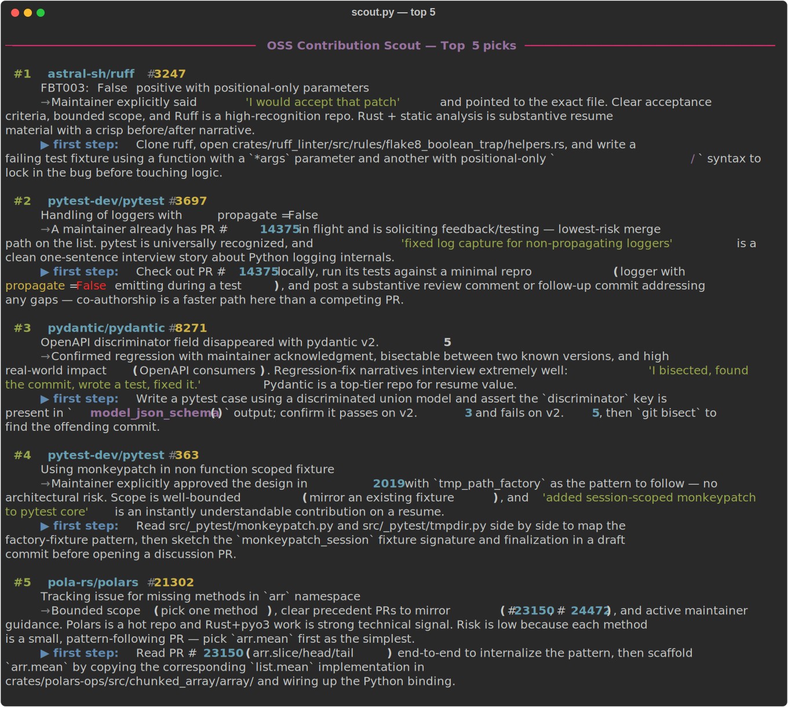
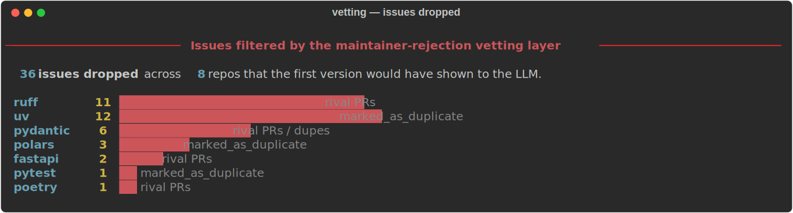
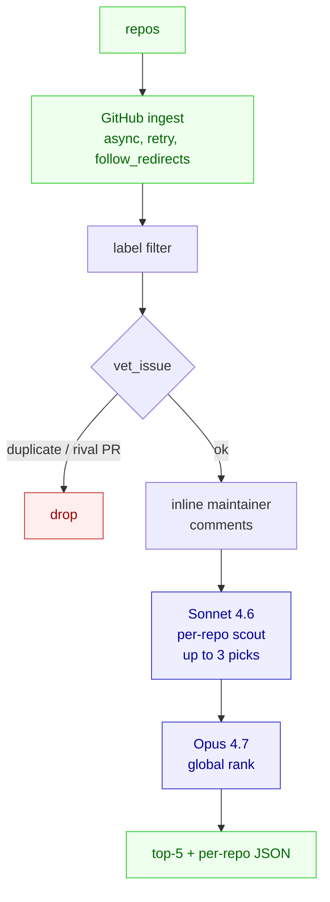

# OSS Contribution Scout

I wanted to find good open-source issues to contribute to — the kind that actually move you forward in interviews, not the "fix a typo in the docs" kind. So I built this.

It's a small multi-agent pipeline: it pulls open issues from a set of well-known Python repos, vets each one for signs that a maintainer would actually accept a fix, and then asks Claude to pick the best three per repo and rank a global top five. Sonnet 4.6 does the per-repo scouting; Opus 4.7 does the final ranking.

Here's what one run looks like:



## Why I bothered

The first version of this tool gave me a confident-looking top five. I went to investigate the first pick — pydantic#11553 — and found that another contributor had already posted basically the obvious fix two days earlier, and a maintainer had silently closed it without comment. So I checked the second pick. Marked as duplicate. Third pick: maintainers had publicly said it wasn't on the roadmap. Fourth: `deferred` label. Fifth: `needs-decision` and an active disagreement in the thread.

All five picks were dead on arrival. The LLM had no idea, because the only signal it ever saw was labels and issue text — not the events, not the comments, not the rival PR that got rejected, not the maintainer saying "we're not going to do this."

That's the bug worth fixing.

## What I added

Three deterministic checks plus inlining maintainer comments into the prompt:

1. **Drop on `marked_as_duplicate` events.** This alone caught most of the bad uv and polars picks.
2. **Drop on rejected rival PRs.** Scan the issue's body and comments for `#NNN` references, resolve each one, and if any is a closed-unmerged PR whose closer ≠ author, the issue's been tried and rejected. Don't recommend it.
3. **Add `needs-decision`, `deferred`, `not-planned`, `blocked`, `roadmap` to the label exclusion list.** Cheap and covered the remaining two.
4. **Inline the last three maintainer comments into the LLM context.** Now Claude can read sentiment ("we'd rather invest in X" / "I would accept that patch") and weigh it.

Across 8 repos, the new vetting drops about 36 issues that the old version would have happily shown to the LLM:



After the change, the same 8 repos produced a different top five — every pick now has a confirmed maintainer-acceptance signal you can find in-thread.

## Two GitHub-API findings I didn't expect

If you're going to do something similar, save yourself an hour:

- **`/issues/{n}/events` does not include `cross-referenced` events.** You need `/issues/{n}/timeline`. Even there, "Fixes #N" references in a PR's body don't always surface as events. The reliable path was scanning the issue's own body and comment bodies for `#NNN` patterns and resolving each candidate via `/issues/{n}` — that endpoint returns `pull_request.merged_at` for PRs.
- **`closed_by` on the PR object is null surprisingly often.** The actual closer lives in `/issues/{n}/events` under the `closed` event's `actor`. Use that to tell a maintainer-rejected PR apart from a self-abandoned one.

## Architecture



The system prompt is cached on the architect call, so a second run on the same repo set hits the cache for the bulk of input tokens. The judge runs once at the end with the full set of picks; that one's not cached because it's a single call.

## Stack

- `anthropic` — Claude API, prompt caching, two-model split
- `httpx` async — GitHub REST with retry on 429/5xx and `follow_redirects=True` (the default repo list contains `tiangolo/fastapi`, which 301s to `fastapi/fastapi`)
- `python-dotenv` for config

## Run it

```bash
python3.12 -m venv .venv
source .venv/bin/activate
pip install -r requirements.txt
cp .env.example .env   # paste in your ANTHROPIC_API_KEY and GITHUB_TOKEN
python scout.py
```

Defaults to 8 well-known Python repos. Override with `--repos`:

```bash
python scout.py --repos pydantic/pydantic astral-sh/ruff --concurrency 6
```

Outputs land in `scout_output/` — one `*_per_repo.json` with up to 3 vetted picks per repo, and one `*_top5.json` with the global ranking.

## Knobs worth knowing about

In `scout.py`:

- `DEFAULT_REPOS` — the repo set to scan
- `INCLUDE` / `EXCLUDE` — label-based pre-filter
- `MAINTAINER_ASSOC` — which `author_association` values count as a maintainer (`OWNER`, `MEMBER`, `COLLABORATOR`)
- `RIVAL_PR_LOOKBACK_DAYS` — how far back to look for closed-unmerged "Fixes #N" PRs

## Regenerating the screenshots

The SVGs in `assets/` come from `scripts/render_screenshots.py`, which uses [`rich`](https://github.com/Textualize/rich) to render the latest run's output as a colourful terminal screenshot.

```bash
pip install rich
python scripts/render_screenshots.py
```
